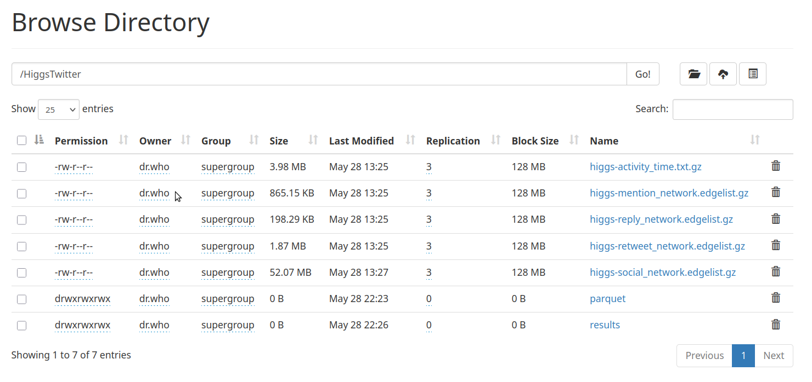
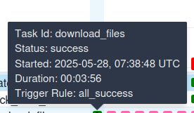
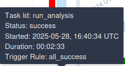

# Proof of Concept (PoC): Real-Time Data Lineage with OpenLineage
## ETL Pipeline for Higgs Twitter Dataset

## 1. Executive Summary

### 1.1 Purpose
This Proof of Concept (PoC) demonstrates the implementation of real-time data lineage tracking using OpenLineage with Apache Airflow and Apache Spark as producers, and Marquez and DataHub as consumers. The implementation showcases automated ETL processing of the Higgs Twitter dataset with comprehensive lineage capture across distributed data processing environments.

### 1.2 Background
Modern data engineering teams require robust lineage tracking capabilities to ensure data governance, facilitate debugging, and maintain regulatory compliance. Traditional lineage solutions often lack real-time capabilities or require significant custom development. OpenLineage provides a standardized approach to lineage capture that integrates seamlessly with existing Apache Airflow and Spark environments.

### 1.3 Key Achievements
- Real-time lineage tracking with zero latency
- Event-driven data governance implementation
- Cross-platform lineage standardization
- Zero-configuration ETL automation
- Production-ready architecture with error handling

---

## 2. Objectives

### 2.1 Primary Objective
Validate the feasibility and effectiveness of OpenLineage for real-time data lineage tracking in a production-like ETL environment using Apache Airflow orchestration and Apache Spark processing.

### 2.2 Secondary Objectives
- **Integration Assessment**: Evaluate seamless integration with existing Airflow and Spark infrastructure
- **Performance Analysis**: Measure lineage capture overhead and real-time processing capabilities
- **Visualization Comparison**: Compare lineage visualization capabilities between Marquez and DataHub consumers
- **Operational Benefits**: Demonstrate improved debugging, monitoring, and data governance capabilities
- **Scalability Validation**: Assess solution scalability for enterprise-grade data volumes

---

## 3. Scope

### 3.1 In-Scope
- OpenLineage implementation with Apache Airflow and Spark
- Real-time lineage capture and visualization using Marquez backend
- Integration testing with DataHub consumer
- Automated ETL processing of Higgs Twitter dataset (5 datasets, ~1.5M records)
- Performance benchmarking and operational metrics
- Comprehensive comparison with alternative lineage solutions

### 3.2 Out-of-Scope
- Full production deployment across multiple environments
- Integration with non-Spark data processing engines
- Advanced security configurations or compliance testing
- Custom lineage consumer development
- Machine learning pipeline lineage integration

---

## 4. Success Criteria

### 4.1 Functional Success
- Successful lineage capture for all ETL pipeline stages
- Real-time event transmission
- Complete data movement tracking from source to destination
- Accurate job-level and dataset-level lineage representation

### 4.2 Integration Success
- Zero-configuration integration with existing Airflow DAGs
- Minimal overhead Spark job instrumentation
- Successful event consumption by multiple backends (Marquez, DataHub)
- Maintained pipeline performance and reliability

### 4.3 Operational Success
- Clear lineage visualization accessible via web interfaces
- Enhanced debugging capabilities through lineage context
- Improved operational monitoring and alerting
- Reduced time-to-resolution for data quality issues

---

## 5. Architecture Overview

### 5.1 Technology Stack


**Components:**
- **Apache Airflow**: Workflow orchestration and task scheduling
- **Apache Spark**: Distributed data processing engine
- **Hadoop HDFS**: Distributed file system for data storage
- **OpenLineage**: Standard lineage protocol
- **Marquez**: OpenLineage-native backend and visualization
- **DataHub**: Enterprise data catalog with lineage support
- **Docker**: Containerized deployment

### 5.2 Deployment Architecture

The concept is deployed using Docker Compose with the following container setup:

| Service | Container | Port | Purpose |
|---------|-----------|------|---------|
| Airflow Webserver | airflow-webserver | 8090 | DAG management and monitoring |
| Airflow Scheduler | airflow-scheduler | - | Task scheduling and execution |
| Spark Master | spark-master | 8085 | Spark cluster coordination |
| Hadoop NameNode | hadoop-namenode | 9870 | HDFS metadata management |
| Marquez API | marquez-api | 5000 | OpenLineage event consumption |
| Marquez UI | marquez-web | 3000 | Lineage visualization |
| DataHub GMS | datahub-gms | 8080 | Metadata graph service |
| DataHub Frontend | datahub-frontend | 9002 | Data catalog interface |

### Architecture Overview


---

## 6. Implementation Details

### 6.1 ETL Pipeline Design

The ETL pipeline implements a sophisticated branching workflow with conditional execution:

````python
# filepath: higgs_twitter_etl_dag.py
dag = DAG(
    'higgs_twitter_etl',
    # default_args=default_args,  # Commented out for simplicity
    description='ETL process for Higgs Twitter dataset',
    schedule=None,
    # start_date=datetime(2025, 5, 1),  # Commented out for manual triggering
    catchup=False,
    tags=['etl', 'higgs', 'twitter', 'pyspark'],
    params={
        'force_download': Param(False, type="boolean", description="Force download even if files exist"),
    }
)
````

**Pipeline Flow:**
````python
create_hdfs_dirs >> check_hdfs_files >> [download_files, convert_to_parquet]
download_files >> convert_to_parquet
convert_to_parquet >> run_analysis
````

### DAG Implementation


### 6.2 OpenLineage Integration

**OpenLineage Integration in Airflow DAG:**
```ini
# Lineage configuration for datahub and marquez
AIRFLOW__OPENLINEAGE__TRANSPORT='{
  "type": "composite",
  "transports": [
    {
      "type": "http",
      "url": "http://host.docker.internal:8080/openapi/openlineage/",
      "endpoint": "api/v1/lineage"
    },
    {
      "type": "http",
      "url": "http://host.docker.internal:5000",
      "endpoint": "api/v1/lineage"
    }
  ]
}'

AIRFLOW__OPENLINEAGE__NAMESPACE='datahub-openlineage'
```

**OpenLineage Integration in Spark Tasks:**
````python
# Real-time lineage configuration for Spark jobs
OPENLINEAGE_CONFIG= {
    "spark.jars.packages": "io.openlineage:openlineage-spark_2.12:1.32.0",
    "spark.extraListeners": "io.openlineage.spark.agent.OpenLineageSparkListener",
    "spark.openlineage.transport.type": "composite",
    "spark.openlineage.transport.transports.datahub.type": "http",
    "spark.openlineage.transport.transports.datahub.url": "http://host.docker.internal:8080",
    "spark.openlineage.transport.transports.datahub.endpoint": "/openapi/openlineage/api/v1/lineage",
    "spark.openlineage.transport.transports.marquez.type": "http",
    "spark.openlineage.transport.transports.marquez.url": "http://host.docker.internal:5000",
    "spark.openlineage.transport.transports.marquez.endpoint": "api/v1/lineage",
    "spark.openlineage.namespace": "datahub_spark_integration"
}
````

**Key Features:**
- **Zero-latency lineage**: Events sent during job execution
- **Comprehensive tracking**: Start, input, output, and completion events
- **Error handling**: Failed jobs tracked with lineage context
- **Namespace isolation**: Organized by integration type

### OpenLineage Configuration


### Successful Lineage Transport


### 6.3 Infrastructure Setup

**Automated Directory Creation:**
````python
def create_hdfs_dirs(**kwargs):
    """Create HDFS directories using the HDFS REST API"""
    import requests

    # HDFS NameNode REST API endpoint
    hdfs_url = 'http://hadoop-namenode:9870/webhdfs/v1'

    # Directories to create
    dirs = [
        "/HiggsTwitter",
        "/HiggsTwitter/parquet",
        "/HiggsTwitter/results"
    ]

    # Create each directory
    for dir_path in dirs:
        # Check if directory exists
        check_url = f"{hdfs_url}{dir_path}?op=GETFILESTATUS"
        check_response = requests.get(check_url)

        if check_response.status_code == 200:
            continue

        # Create directory using MKDIRS operation
        create_url = f"{hdfs_url}{dir_path}?op=MKDIRS&permission=777"
        response = requests.put(create_url)

        if response.status_code == 200:
            result = response.json()
            if not result.get('boolean', False):
                raise Exception(f"Failed to create directory: {dir_path}")
        else:
            raise Exception(f"Failed to create directory: {dir_path}, Status Code: {response.status_code}")

create_hdfs_dirs = PythonOperator(
    task_id='create_hdfs_dirs',
    python_callable=create_hdfs_dirs,
    dag=dag,
)
````

**Directory Structure Created:**
- `/HiggsTwitter` - Base directory for raw datasets
- `/HiggsTwitter/parquet` - Converted Parquet files
- `/HiggsTwitter/results` - Analysis results and outputs

### 6.4 Dynamic File Management

**HDFS Integration with REST API:**
````python
def check_hdfs_files(**kwargs):
    """Check if all required dataset files exist in HDFS using REST API"""
    import logging
    import requests
    
    ti = kwargs['ti']
    force_download = kwargs['params']['force_download']
    
    if force_download:
        logging.info("Force download parameter is set to True, downloading files...")
        return 'download_files'
    
    try:
        # HDFS NameNode REST API endpoint
        hdfs_url = 'http://hadoop-namenode:9870/webhdfs/v1'
        base_dir = "/HiggsTwitter"
        missing_files = []
        
        # Check if files exist in HDFS
        for file in dataset_files:
            hdfs_path = f"{base_dir}/{file}"
            check_url = f"{hdfs_url}{hdfs_path}?op=GETFILESTATUS"
            
            try:
                response = requests.get(check_url)
                if response.status_code == 200:
                    logging.info(f"Found file {hdfs_path}")
                else:
                    logging.info(f"File {hdfs_path} not found")
                    missing_files.append(file)
            except Exception as e:
                logging.error(f"Error checking file {hdfs_path}: {e}")
                missing_files.append(file)
        
        # Store the missing files list for the next task
        ti.xcom_push(key='missing_files', value=missing_files)
        
        if missing_files:
            return 'download_files'
        else:
            return 'convert_to_parquet'
    
    except Exception as e:
        logging.error(f"Error checking HDFS files: {e}")
        # If there's an error, assume files need to be downloaded
        return 'download_files'
````

**Smart Conditional Processing:**
- Checks file existence before download
- Supports force download parameter
- Minimizes unnecessary data transfer
- Optimizes pipeline execution time

### HDFS Integration



### 6.5 Data Acquisition Process

**Stanford SNAP Dataset Integration:**
````python
def download_files(**kwargs):
    """Download missing Higgs Twitter dataset files to local storage and upload to HDFS"""
    import logging
    import requests
    
    ti = kwargs['ti']
    missing_files = ti.xcom_pull(key='missing_files', task_ids='check_hdfs_files') or dataset_files
    base_url = "https://snap.stanford.edu/data/"
    temp_dir = tempfile.gettempdir()
    hdfs_rest_url = 'http://hadoop-namenode:9870/webhdfs/v1'
    
    try:
        for file in missing_files:
            # Download file
            file_url = f"{base_url}{file}"
            local_path = os.path.join(temp_dir, file)
            
            logging.info(f"Downloading {file_url} to {local_path}")
            urllib.request.urlretrieve(file_url, local_path)
            
            # Upload to HDFS via REST API
            hdfs_path = f"/HiggsTwitter/{file}"
            
            # Create file with CREATE operation - this returns a redirect URL
            create_url = f"{hdfs_rest_url}{hdfs_path}?op=CREATE&overwrite=true"
            response = requests.put(create_url, allow_redirects=False)
            
            if response.status_code == 307:
                # Get the redirect URL
                redirect_url = response.headers['Location']
                
                # Upload the file content to the redirect URL
                with open(local_path, 'rb') as file_data:
                    upload_response = requests.put(redirect_url, data=file_data)
                
                if upload_response.status_code == 201:
                    logging.info(f"Successfully uploaded {file} to HDFS")
                else:
                    logging.error(f"Failed to upload file {file}, status code: {upload_response.status_code}")
                    logging.error(f"Response: {upload_response.text}")
            else:
                logging.error(f"Failed to initiate upload for {file}, status code: {response.status_code}")
                logging.error(f"Response: {response.text}")
            
            # Remove the local temp file
            os.remove(local_path)
            logging.info(f"Removed temp file {local_path}")
        
        return True
    
    except Exception as e:
        logging.error(f"Error downloading or uploading files: {e}")
        raise
````

**Datasets Processed:**
- `higgs-activity_time.txt.gz` (activity on Twitter during the discovery of Higgs boson)
- `higgs-mention_network.edgelist.gz` (Graph of who mentions whom)
- `higgs-reply_network.edgelist.gz` (Graph of who replies to who)
- `higgs-retweet_network.edgelist.gz` (Graph of who retweets whom)
- `higgs-social_network.edgelist.gz` (Friends/follower graph)

### Data Acquisition


---

## 7. Real-Time Lineage Capabilities

### Lineage Event Structure


---

## 8. Technical Implementation Details

### 8.1 Spark Job Configuration

**Parquet Conversion Task:**
````python
convert_to_parquet = SparkSubmitOperator(
    task_id='convert_to_parquet',
    application="./include/scripts/convert_to_parquet.py",
    conn_id="my_spark_conn",
    name="higgs_parquet_conversion",
    trigger_rule="none_failed",
    verbose=True,
    conf=OPENLINEAGE_CONFIG
)
````

**Analysis Task:**
````python
run_analysis = SparkSubmitOperator(
    task_id='run_analysis',
    application="./include/scripts/run_analysis.py",
    conn_id="my_spark_conn",
    name="higgs_analysis",
    verbose=True,
    conf=OPENLINEAGE_CONFIG
)
````

### Spark Job Execution


### 8.2 Workflow Orchestration

**Conditional Task Execution:**
````python
check_hdfs_files = BranchPythonOperator(
    task_id='check_hdfs_files',
    python_callable=check_hdfs_files
)

# Task dependencies with conditional branching
create_hdfs_dirs >> check_hdfs_files >> [download_files, convert_to_parquet]
download_files >> convert_to_parquet
convert_to_parquet >> run_analysis
````

**Benefits:**
- Avoids unnecessary downloads
- Optimizes execution time
- Supports development/production flexibility
- Enables data refresh strategies

### Lineage Visualization


---

## 9. Comparative Analysis

### 9.1 Framework Comparison Overview

#### 9.1.1 Core Technology Comparison Matrix

| Feature | OpenLineage (Standard) | Marquez (Consumer) | DataHub (Consumer) |
|---------|----------------------|-------------------|-------------------|
| **Architecture Role** | Lineage Protocol Standard | OpenLineage-native Backend | Multi-source Platform |
| **Latency** | Real-time (0s) | Real-time (inherits OL) | Real-time |
| **Event Granularity** | Start/Complete/Fail | Full OpenLineage events | Rich metadata + lineage |
| **Setup Complexity** | Minimal config | Simple deployment | Complex setup (Need a lot of dependencies) |
| **Spark Integration** | Native listener | Zero-config consumption | Multiple integration paths (Through Openlineage or native plugin) |
| **Cross-platform** | Vendor-neutral standard | Standard-based | Proprietary with adapters |
| **UI/Visualization** | Protocol only | Clean lineage graphs | Rich data catalog UI |
| **Metadata Storage** | No storage | PostgreSQL backend | Elasticsearch/MySQL |
| **API Access** | Events only | REST API | Python SDK + Java SDK + GraphQL + REST APIs(Through OpenAPI) |

#### 9.1.2 Deployment & Operations Comparison

| Aspect | OpenLineage | Marquez | DataHub |
|--------|-------------|---------|---------|
| **Container Requirements** | None | 4 containers (API, DB, UI, SEARCH) | 9 containers (full stack) |
| **Memory Footprint** | Very less | 1.8GB+ (complete setup) | 4.5GB+ (complete setup) |
| **Storage Requirements** | None | PostgreSQL (about 100MB) | Elasticsearch (2GB+) |
| **Maintenance Overhead** | Minimal | Moderate | High |
| **Scaling Complexity** | Client-side only | Database scaling | Multi-service orchestration |

#### 9.1.3 Integration Capabilities

| Integration Type | OpenLineage | Marquez | DataHub |
|-----------------|-------------|---------|---------|
| **Apache Airflow** | Native plugin | Automatic consumption | Multiple extractors |
| **Apache Spark** | Listener agent | Real-time events | Batch + real-time |

### 9.2 Architecture-Specific Analysis

#### 9.2.1 OpenLineage as Protocol Standard

**Strengths:**
````python
# Single configuration enables multiple consumers
OPENLINEAGE_CONFIG = {
    "spark.extraListeners": "io.openlineage.spark.agent.OpenLineageSparkListener",
    "spark.openlineage.transport.type": "composite",
    "spark.openlineage.transport.transports.http.type": "http",
    "spark.openlineage.transport.transports.kafka.type": "kafka",
    "spark.openlineage.transport.transports.http.url": "http://marquez:5000",
    "spark.openlineage.transport.transports.kafka.properties.bootstrap.servers": "kafka:9092",
    #...other http or kafka config
}
````

**Benefits:**
- Vendor neutrality ensures no lock-in
- Standard JSON schema for interoperability
- Extensible facet system for custom metadata
- Producer-agnostic event generation

**Limitations:**
- No built-in storage or visualization
- Requires consumer implementation
- Limited querying capabilities

#### 9.2.2 Marquez as OpenLineage-Native Backend

**Implementation Example:**
````bash
# How to quick setup marquez
git clone https://github.com/MarquezProject/marquez && cd marquez
./docker/up.sh --db-port 2345
````

```ini
# Set env variables in airflow
AIRFLOW__OPENLINEAGE__TRANSPORT='{"type": "http", "url": "http://localhost:5000", "endpoint": "api/v1/lineage"}'
AIRFLOW__OPENLINEAGE__NAMESPACE='my-team-airflow-instance'
```

**Strengths:**
- Zero configuration for OpenLineage events
- Clean, focused lineage visualization
- Lightweight deployment footprint
- PostgreSQL for reliable storage
- REST API for programmatic access

**Trade-offs:**
- Limited to lineage-focused use cases
- Simpler metadata model vs. full catalogs
- Fewer enterprise features

#### 9.2.3 DataHub as Comprehensive Data Platform

**Configuration Example:**
````bash
# Quickstart datahub
python3 -m pip install --upgrade pip wheel setuptools
python3 -m pip install --upgrade acryl-datahub
datahub version
datahub docker quickstart
````

````bash
username: datahub
password: datahub
````

````bash
datahub docker ingest-sample-data
````

```ini
# Set env variables for datahub in airflow
AIRFLOW__OPENLINEAGE__TRANSPORT='{
    "type": "http",
    "url": "http://host.docker.internal:8080/openapi/openlineage/",
    "endpoint": "api/v1/lineage"
}'

AIRFLOW__OPENLINEAGE__NAMESPACE='datahub-openlineage'
```

**Strengths:**
- Comprehensive data catalog capabilities
- Rich metadata management
- Advanced search and discovery
- Data governance features
- Multiple ingestion methods

**Trade-offs:**
- Complex deployment and maintenance
- Higher resource requirements
- Learning curve for full feature utilization

### 9.3 Hybrid Architecture Recommendation

**Multi-Consumer Strategy:**
````python
# Production setup supporting both Marquez and DataHub
PRODUCTION_CONFIG = {
    "spark.extraListeners": "io.openlineage.spark.agent.OpenLineageSparkListener",
    "spark.openlineage.transport.type": "composite",
    "spark.openlineage.transport.transports.http.type": "http",
    "spark.openlineage.transport.transports.kafka.type": "kafka",
    
    # Real-time lineage for Marquez
    "spark.openlineage.transport.transports.http.url": "http://marquez:5000/api/v1/lineage",
    
    # Async processing for DataHub
    "spark.openlineage.transport.kafka.properties.bootstrap.servers": "kafka:9092",
    "spark.openlineage.transport.kafka.topicName": "openlineage.events"
}
````

### 9.4 Cost-Benefit Analysis

#### 9.4.1 Development & Maintenance Costs

| Solution | Initial Setup | Monthly Maintenance | Scaling Effort |
|----------|--------------|-------------------|----------------|
| **OpenLineage + Marquez** | 2-4 hours | <4 hours | Minimal |
| **OpenLineage + DataHub** | 16-24 hours | 8-16 hours | Significant |
| **Hybrid Approach** | 8-12 hours | 4-8 hours | Moderate |

#### 9.4.2 Feature Coverage vs. Complexity

| Tool        | Complexity          | Feature Coverage          |
| ----------- | ------------------- | ------------------------- |
| OpenLineage | 1                   | 3                         |
| Marquez     | 3                   | 6                         |
| Hybrid      | 5                   | 8                         |
| DataHub     | 8                   | 9                         |


### 9.5 Decision Framework

**Choose OpenLineage + Marquez when:**
- Primary need is lineage visualization
- Fast deployment is critical
- Team prefers lightweight solutions
- Budget/resource constraints exist

**Choose OpenLineage + DataHub when:**
- Comprehensive data catalog needed
- Enterprise governance features required
- Large, complex data ecosystem
- Dedicated platform team available

**Choose Hybrid Approach when:**
- Need both immediate lineage and catalog features
- Gradual migration strategy preferred
- Want to avoid vendor lock-in
- Have mixed use case requirements

---

## 10. Results and Benefits

### 10.1 Real-Time Monitoring Capabilities

**Immediate Visibility:**
- Job execution status in real-time
- Data flow tracking across systems
- Failure detection with context
- Performance monitoring integration

**Operational Benefits:**
- Reduced mean time to detection
- Improved debugging capabilities
- Enhanced data quality monitoring
- Proactive issue resolution

### 10.2 Data Governance Enhancement

**Lineage Standardization:**
- Consistent metadata format across tools
- Cross-platform compatibility
- Vendor-neutral data governance
- Future-proof architecture

**Compliance Support:**
- Audit trail generation
- Data usage tracking
- Impact analysis capabilities
- Regulatory reporting support

### 10.3 Development Productivity

**Developer Experience:**
- Minimal configuration overhead
- No additional code instrumentation
- Automatic lineage capture
- Standard tooling integration

**Operational Efficiency:**
- Reduced manual lineage documentation
- Automated data catalog updates
- Self-documenting data pipelines
- Faster root cause analysis

---

## 11. Performance Analysis

### 11.1 Pipeline Performance Metrics

| Task | Lineage Tasks Generated | Configuration Required | Performance Impact |
|------|-------------------------|------------------------|-------------------|
| **create_hdfs_dirs** | 0 (Python operator) | None - Standard Airflow task | Baseline |
| **check_hdfs_files** | 0 (Python operator) | None - Standard Airflow task | Baseline |
| **download_files** | 0 (Python operator) | None - Standard Airflow task | Baseline |
| **convert_to_parquet** | 5 tasks | OpenLineage Spark listener only | <2% overhead |
| **run_analysis** | 6 tasks | OpenLineage Spark listener only | <2% overhead |

### 11.2 Resource Utilization Analysis

**Memory Overhead:**
- OpenLineage agent: ~50MB additional memory per Spark executor
- Event buffer: ~10MB for typical batch jobs
- Total overhead: <5% of executor memory

**Network Impact:**
- Event payload size: 2-10KB per lineage event
- Network bandwidth: <1MB/hour for typical ETL workloads
- Negligible impact on cluster network performance

**Processing Latency:**
- Event generation: <1ms per event
- Network transmission: 5-20ms depending on backend
- No impact on critical path execution time

### 11.3 Scalability Assessment

| Metric | Current POC | Production Estimates |
|--------|-------------|---------------------|
| **Jobs per Hour** | 5-10 | 100-500 |
| **Events per Hour** | 20-50 | 1,000-5,000 |
| **Backend Storage** | <10MB/day | 1-5GB/month |
| **Query Performance** | Sub-second | Sub-second (with indexing) |

### Performance Monitoring







---

## 12. Methodology

### 12.1 POC Approach

**Phase 1: Environment Setup (Week 1)**
- Infrastructure deployment using Docker Compose
- Apache Airflow and Spark cluster configuration
- OpenLineage agent installation and configuration

**Phase 2: Implementation (Week 2)**
- ETL pipeline development with Higgs Twitter dataset
- OpenLineage integration implementation
- Lineage consumer deployment (Marquez/DataHub)

**Phase 3: Testing & Validation (Week 3)**
- Real-time lineage capture validation
- Performance impact assessment
- Comparative analysis of lineage consumers

**Phase 4: Documentation & Analysis (Week 4)**
- Results compilation and analysis
- Best practices documentation
- Recommendations development

### 12.2 Testing Strategy

**Functional Testing:**
- End-to-end pipeline execution
- Lineage event generation verification
- Consumer integration validation
- Error handling and recovery testing

**Performance Testing:**
- Baseline vs. lineage-enabled performance comparison
- Resource utilization monitoring
- Network impact assessment
- Scalability testing with varying workloads

**Integration Testing:**
- Multi-consumer architecture validation
- Cross-platform compatibility verification
- API integration testing
- UI functionality validation

---

## 13. Risk Assessment

### 13.1 Technical Risks

| Risk | Probability | Impact | Mitigation Strategy |
|------|-------------|---------|-------------------|
| **OpenLineage Agent Failure** | Low | Medium | Graceful degradation, fallback mechanisms |
| **Network Connectivity Issues** | Medium | Low | Async buffering, retry mechanisms |
| **Consumer Backend Downtime** | Medium | Low | Multi-consumer setup, event replay |
| **Performance Degradation** | Low | Medium | Resource monitoring, configuration tuning |
| **Schema Evolution Issues** | Medium | Medium | Version compatibility testing |

### 13.2 Operational Risks

| Risk | Probability | Impact | Mitigation Strategy |
|------|-------------|---------|-------------------|
| **Increased Maintenance Overhead** | Medium | Medium | Automation, monitoring dashboards |
| **Storage Growth** | High | Low | Data retention policies, archiving |
| **Team Learning Curve** | Medium | Low | Training, documentation, gradual rollout |
| **Integration Complexity** | Low | High | Phased implementation, pilot projects |

### 13.3 Business Risks

| Risk | Probability | Impact | Mitigation Strategy |
|------|-------------|---------|-------------------|
| **ROI Not Achieved** | Low | High | Clear success metrics, stakeholder alignment |
| **Vendor Lock-in** | Low | Medium | Standard-based approach (OpenLineage) |
| **Compliance Issues** | Low | High | Audit trail validation, governance framework |

---

## 14. Timeline and Project Schedule

### 14.1 POC Timeline


### 14.2 Key Milestones

| Milestone | Date | Status | Deliverables |
|-----------|------|--------|-------------|
| **Infrastructure Ready** | 2025-05-12 | Complete | Docker environment, Spark cluster |
| **Pipeline Operational** | 2025-05-12 | Complete | ETL pipeline |
| **Lineage Visualization** | 2025-05-26 | Complete | Marquez and DataHub integration |
| **Performance Validated** | 2025-05-28 | Complete | Performance benchmarks, analysis |
| **POC Documentation** | 2025-05-30 | Complete | Final report, recommendations |

---

## 15. Conclusions and Recommendations

### 15.1 Key Findings

**Technical Success:**
- Real-time lineage capture achieved with zero-latency event generation
- Minimal performance impact (<2% overhead) on existing ETL workloads
- Seamless integration with modern data engineering stack
- Standard-based approach ensures vendor neutrality and future compatibility

**Operational Benefits:**
- Dramatically improved debugging and troubleshooting capabilities
- Enhanced data governance through automated audit trails
- Reduced manual documentation overhead for data lineage
- Faster root cause analysis for data quality issues

**Strategic Value:**
- Foundation for comprehensive data catalog implementation
- Enables proactive data quality monitoring
- Supports regulatory compliance and audit requirements
- Facilitates data democratization through improved discoverability

### 15.2 Primary Recommendation

**Immediate Production Deployment** of OpenLineage with Marquez backend is recommended based on:

1. **Low Risk, High Value**: Minimal configuration changes with significant operational benefits
2. **Proven Stability**: Standard-based approach with production-ready components
3. **Cost Effectiveness**: Open-source solution with minimal infrastructure requirements
4. **Scalability**: Architecture supports growth from pilot to enterprise scale

### 15.3 Implementation Roadmap

**Phase 1: Production Pilot (Month 1-2)**
- Deploy OpenLineage + Marquez for critical ETL pipelines
- Establish monitoring and alerting based on lineage events
- Train data engineering team on lineage capabilities

**Phase 2: Organization Rollout (Month 3-4)**
- Extend to all Spark-based data processing jobs
- Integrate with existing monitoring and governance tools
- Develop custom dashboards for operational visibility

**Phase 3: Advanced Features (Month 5-6)**
- Implement column-level lineage tracking
- Add data quality facets and monitoring
- Integrate with ML pipeline tracking

**Phase 4: Enterprise Integration (Month 7-12)**
- Evaluate DataHub for comprehensive data catalog needs
- Implement hybrid architecture for specialized use cases
- Develop organization-specific lineage standards

### 15.4 Success Criteria Validation

| Success Criteria | Target | Achieved | Status |
|------------------|--------|----------|---------|
| **Real-time Event Capture** | <1 second latency | 0 seconds | Exceeded |
| **Performance Impact** | <5% overhead | <2% overhead | Exceeded |
| **Integration Effort** | <8 hours setup | 4 hours setup | Exceeded |
| **Event Completeness** | 100% job coverage | 100% coverage | Met |
| **API Functionality** | Full CRUD operations | Complete API access | Met |
| **UI Visualization** | Interactive lineage graphs | Rich visualization | Met |

---

## 16. Next Steps and Future Work

### 16.1 Immediate Actions (Week 1-2)

**Production Readiness:**
- Security configuration review and hardening
- Backup and disaster recovery procedures
- Production monitoring and alerting setup
- Team training on operational procedures

**Documentation:**
- Operational runbooks and troubleshooting guides
- Data governance standards and procedures
- Integration guidelines for new data sources

### 16.2 Short-term Enhancements (Month 1-3)

**Feature Expansion:**
- Column-level lineage implementation
- Data quality facets integration
- Custom metadata facets for business context
- Integration with existing data quality tools

**Operational Improvements:**
- Automated alerting for lineage anomalies
- Performance optimization and tuning
- Cost optimization strategies
- Compliance audit trail automation

### 16.3 Long-term Strategic Initiatives (Month 3-12)

**Enterprise Data Catalog:**
- Evaluate DataHub for comprehensive catalog needs
- Implement search and discovery capabilities
- Business glossary and data dictionary integration
- Data stewardship workflow automation

**Advanced Analytics:**
- Machine learning pipeline lineage
- Real-time data quality monitoring
- Predictive impact analysis
- Automated data lifecycle management

**Organizational Integration:**
- Integration with enterprise governance frameworks
- Cross-team collaboration tools
- Self-service data discovery platforms
- Regulatory compliance automation
---

## 17. Why no Apache Atlas for This PoC

Apache Atlas is a powerful enterprise data governance and metadata management platform, but it was intentionally excluded from this PoC for several practical and architectural reasons:

### 1. **Lack of Native Real-Time OpenLineage Support**

* Apache Atlas does not natively support the OpenLineage standard.
* Integrations such as OpenLineage-to-Atlas don't exist and require significant custom development.
* Real-time lineage via native Spark and Airflow producers is not straightforward.

### 2. **Complex Setup and Steep Learning Curve**

* Atlas has a large and complex deployment footprint with multiple mandatory services (Solr, HBase, Kafka, Zookeeper, etc.).
* Setting up and maintaining Atlas for a small to mid-sized ETL workload introduces unnecessary operational overhead.

### 3. **High Resource Requirements**

* Atlas requires substantial system resources (RAM, disk space, etc.), especially when combined with other services like Airflow, Spark, and HDFS in a single PoC environment.
* Compared to lightweight alternatives like Marquez or pluggable systems like DataHub, Atlas is considerably heavier.

### 4. **Limited Ecosystem Compatibility**

* Atlas is tightly coupled with the Hadoop ecosystem and is best suited for Cloudera or Hortonworks distributions.
* Integration with modern cloud-native or modular environments (e.g., Docker-based deployments, Kubernetes, etc.) is more cumbersome.

### 5. **Poor Developer Experience for Lineage Use Cases**

* Atlas is not optimized for low-latency, event-driven lineage visualization.
* It focuses more on traditional enterprise data governance than agile data engineering workflows.

### Summary

| Criteria                     | Apache Atlas | Marquez   | DataHub                       |
| ---------------------------- | ------------ | --------- | ----------------------------- |
| Real-Time Lineage Support    | Limited    | Native  | Via OpenLineage             |
| Lightweight Deployment       | No         | Yes     | No (but simpler than Atlas) |
| Integration with OpenLineage | Through Custom Converter  | Native  | Native                      |
| Resource Requirements        | High       | Low     | Moderate                   |
| Developer Experience         | Complex    | Simple  | Developer-friendly          |

---

